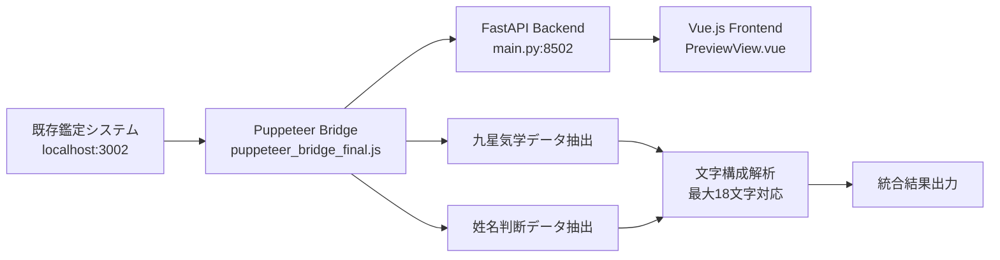

# 既存鑑定システム連携実装ガイド

本ドキュメントは、既存の鑑定システムからデータを取得し、100%同じ結果を表示するシステムを実装するための詳細ガイドです。

## 📋 目次

1. [システム概要](#システム概要)
2. [必要ファイル一覧](#必要ファイル一覧)
3. [アーキテクチャ構成](#アーキテクチャ構成)
4. [実装手順](#実装手順)
5. [重要な実装ポイント](#重要な実装ポイント)
6. [カスタマイズ方法](#カスタマイズ方法)
7. [トラブルシューティング](#トラブルシューティング)

---

## システム概要

このシステムは以下の特徴を持ちます：

- **既存システム完全連携**: Puppeteerを使用して既存鑑定システムからデータを取得
- **100%一致表示**: 既存システムと全く同じ結果を表示
- **可変長名前対応**: 姓名それぞれ最大9文字（計18文字）まで対応
- **リアルタイム取得**: 既存システムの最新結果を動的に取得

### システムフロー
```
[既存鑑定システム] ←→ [Puppeteer Bridge] ←→ [バックエンドAPI] ←→ [フロントエンド表示]
     (port 3002)           (system/)           (backend/)          (frontend/)
```

---

## 必要ファイル一覧

### 🔴 **必須ファイル（絶対に必要）**

#### **1. Puppeteer連携システム**
```
/system/
├── puppeteer_bridge_final.js    # 既存システム連携の核心ファイル
├── package.json                 # Node.js依存関係定義
└── package-lock.json            # 依存関係バージョンロック
```

#### **2. バックエンドサーバー**
```
/backend/
├── main.py                      # メインサーバー（port 8502）
└── requirements.txt             # Python依存関係
```

#### **3. フロントエンド表示**
```
/frontend/src/
├── views/kantei/PreviewView.vue # 鑑定結果表示画面
├── services/api-client.ts       # API通信クライアント
└── package.json                 # フロントエンド依存関係
```

### 🟡 **重要ファイル（実装理解のため）**

#### **4. 設定ファイル**
```
├── .env.local                   # 環境変数（既存システムURL等）
├── .ports.config                # ポート設定
├── docker-compose.yml           # Docker設定
└── vite.config.ts              # フロントエンドビルド設定
```

#### **5. 補助ファイル**
```
/frontend/src/
├── App.vue                      # メインアプリケーション
├── router/index.ts              # ルーティング設定
└── main.ts                      # エントリーポイント
```

---

## アーキテクチャ構成

### データフロー詳細



### 重要なデータ構造

#### **九星気学結果**
```javascript
{
  "data": {
    "本命星": "一白水星",
    "月命星": "九紫火星",
    "日命星": "五黄土星",
    "年齢": "45歳"
  },
  "raw_data": "..." // 管理者モードのみ
}
```

#### **姓名判断結果**
```javascript
{
  "data": {
    "総評点数": 5,
    "詳細結果": true,
    "文字": {
      "姓1": "松", "姓2": "蔭", "姓3": "時",
      "名1": "鶴", "名2": "太", "名3": "郎"
    },
    "画数": {
      "姓1": "8", "姓2": "15", "姓3": "10",
      "名1": "21", "名2": "4", "名3": "10"
    },
    "五行": {
      "姓1": "金", "姓2": "土", "姓3": "金",
      "名1": "木", "名2": "木", "名3": "金"
    },
    "陰陽": {
      "姓1": "陰", "姓2": "陽", "姓3": "陰",
      "名1": "陽", "名2": "陰", "名3": "陰"
    }
  }
}
```

---

## 実装手順

### ステップ1: 環境構築

#### **1.1 前提条件**
```bash
# Node.js 18+ のインストール確認
node --version

# Python 3.9+ のインストール確認
python --version

# 既存鑑定システムが port 3002 で稼働していることを確認
curl http://localhost:3002/kyusei.html
```

#### **1.2 依存関係インストール**
```bash
# Puppeteerシステム
cd system/
npm install

# バックエンド
cd ../backend/
pip install -r requirements.txt

# フロントエンド
cd ../frontend/
npm install
```

### ステップ2: 設定ファイル準備

#### **2.1 環境変数設定（.env.local）**
```env
# 既存システムのベースURL
EXISTING_SYSTEM_BASE_URL=http://localhost:3002

# ポート設定
BACKEND_PORT=8502
FRONTEND_PORT=3000

# デバッグ設定
DEBUG=true
```

#### **2.2 ポート設定（.ports.config）**
```
backend=8502
frontend=3000
existing_system=3002
```

### ステップ3: 核心実装のコピー

#### **3.1 Puppeteer Bridge の設定**
```javascript
// system/puppeteer_bridge_final.js
const EXISTING_SYSTEM_URL = process.env.EXISTING_SYSTEM_BASE_URL || 'http://localhost:3002';

const urls = {
    kyusei: `${EXISTING_SYSTEM_URL}/kyusei.html`,
    seimei: `${EXISTING_SYSTEM_URL}/seimei.html`
};

// 重要: データ抽出ロジック
const extractSeimeiData = async (page) => {
    const rawText = await page.evaluate(() => document.body.innerText);

    // 既存システムの出力形式に合わせた抽出処理
    return {
        score: extractScore(rawText),
        rawText: rawText,
        url: page.url()
    };
};
```

#### **3.2 バックエンド抽出ロジック**
```python
# backend/main.py

def extract_character_composition(raw_text, name_for_seimei):
    """
    核心機能: 名前の文字構成を動的に抽出
    姓名それぞれ最大9文字まで対応（計18文字）
    """
    composition = {
        "画数": {},
        "五行": {},
        "陰陽": {},
        "文字": {}
    }

    # 入力名前から姓と名を分離
    name_parts = name_for_seimei.split(' ')
    sei = name_parts[0] if len(name_parts) > 0 else ""
    mei = name_parts[1] if len(name_parts) > 1 else ""

    # 既存システムの出力形式に合わせた正規表現パターン
    moji_kousei_pattern = r'文字の構成\s*(.+?)(?:(?:画数による鑑定|五行による鑑定|陰陽による鑑定|天地による鑑定)|$)'

    # 動的文字数対応の抽出ロジック
    # ... (詳細な実装はmain.pyを参照)

    return composition

def extract_seimei_details(raw_text, name_for_seimei):
    """
    既存システムとの完全一致を実現する詳細データ抽出
    """
    details = {}

    # 文字構成の抽出
    character_composition = extract_character_composition(raw_text, name_for_seimei)
    details.update(character_composition)

    # 格数の抽出
    details["格数"] = extract_kakusu(raw_text)

    # 天地による鑑定の抽出
    details["鑑定結果"] = {"天地": extract_tenchi_kantei(raw_text)}

    return details
```

#### **3.3 フロントエンド表示コンポーネント**
```vue
<!-- frontend/src/views/kantei/PreviewView.vue -->
<template>
  <div class="character-composition">
    <!-- 文字の表示（可変長対応） -->
    <div class="composition-row">
      <div class="row-label">文字</div>
      <div
        v-for="(char, key) in diagnosis.seimei_result?.data?.文字 || {}"
        :key="key"
        class="character-cell"
      >
        {{ char }}
      </div>
    </div>

    <!-- 画数の表示 -->
    <div class="composition-row">
      <div class="row-label">画数</div>
      <div
        v-for="(stroke, key) in diagnosis.seimei_result?.data?.画数 || {}"
        :key="key"
        class="stroke-cell"
      >
        {{ stroke }}
      </div>
    </div>

    <!-- 管理者モードの詳細データ -->
    <details v-if="adminMode" class="raw-data">
      <summary>詳細データ（技術者向け）</summary>
      <pre>{{ JSON.stringify(diagnosis.seimei_result.data, null, 2) }}</pre>
    </details>
  </div>
</template>

<script setup lang="ts">
// 管理者モード制御
const adminMode = ref(false);

const toggleAdminMode = async () => {
  adminMode.value = !adminMode.value;
  await loadDiagnosis(); // データ再読み込み
};
</script>
```

---

## 重要な実装ポイント

### 1. 可変長名前対応の実装

#### **問題**
従来の固定4文字対応では長い名前（例：「松蔭時 鶴太郎」6文字）が正しく表示されない

#### **解決策**
```python
# 動的配列による可変長対応
def get_character_array(sei, mei):
    """姓名それぞれ最大9文字まで動的に処理"""
    characters = {}

    # 姓の処理（最大9文字）
    for i, char in enumerate(sei[:9]):
        characters[f"姓{i+1}"] = char

    # 名の処理（最大9文字）
    for i, char in enumerate(mei[:9]):
        characters[f"名{i+1}"] = char

    return characters
```

### 2. 既存システムHTML解析の最適化

#### **重要なパターン**
```python
# 文字構成セクションの抽出
moji_kousei_pattern = r'文字の構成\s*(.+?)(?:(?:画数による鑑定|五行による鑑定)|$)'

# 天地による鑑定の抽出
tenchi_patterns = {
    'dousu': r'(.*?)は天地同数\((\w+)\)です。(.*?)(?=\n\n|\n[一-龯]|$)',
    'soudousu': r'(.*?)は天地総同数です。(.*?)(?=\n\n|\n[一-龯]|$)',
    'shoutotsu': r'(.*?)は天地衝突です。(.*?)(?=\n\n|\n[一-龯]|$)'
}
```

### 3. エラーハンドリング

#### **Puppeteer関連**
```javascript
// タイムアウト設定
await page.goto(url, {
    waitUntil: 'networkidle2',
    timeout: 30000
});

// エラーリトライ機能
let retries = 3;
while (retries > 0) {
    try {
        const result = await extractData(page);
        return result;
    } catch (error) {
        retries--;
        if (retries === 0) throw error;
        await new Promise(resolve => setTimeout(resolve, 1000));
    }
}
```

#### **バックエンド**
```python
# 例外処理とデバッグ情報
try:
    seimei_details = extract_seimei_details(raw_result.get("raw_text", ""), name_for_seimei)
    print(f"DEBUG: 抽出された詳細データ: {seimei_details}")
except Exception as e:
    print(f"文字構成抽出エラー: {e}")
    # フォールバック処理
```

---

## カスタマイズ方法

### 1. 既存システムURL変更

```javascript
// system/puppeteer_bridge_final.js
const urls = {
    kyusei: "http://your-system.com:port/kyusei.html",
    seimei: "http://your-system.com:port/seimei.html"
};
```

### 2. データ抽出パターンの調整

```python
# backend/main.py
# 既存システムの出力形式に合わせてパターンを調整

# 例: 文字構成セクションの開始・終了パターン変更
moji_kousei_pattern = r'あなたの文字構成\s*(.+?)(?:(?:総合評価|詳細分析)|$)'

# 例: 格数表示形式の変更
kakusu_pattern = r'天格：(\d+)画.*?人格：(\d+)画.*?地格：(\d+)画.*?総格：(\d+)画'
```

### 3. 表示レイアウトのカスタマイズ

```vue
<!-- frontend/src/views/kantei/PreviewView.vue -->
<style scoped lang="scss">
.character-composition {
  // 既存システムに合わせたスタイル調整
  font-family: "MS Gothic", monospace; // フォント変更

  .composition-row {
    border: 1px solid #ccc; // 枠線追加
    padding: 8px;           // パディング調整
  }

  .character-cell {
    min-width: 40px;        // セル幅調整
    text-align: center;     // 中央揃え
  }
}
</style>
```

### 4. 管理者権限機能の追加

```python
# backend/main.py
@app.get("/api/diagnosis/{diagnosis_id}")
async def get_diagnosis(diagnosis_id: str, admin_mode: bool = False):
    """管理者モードで詳細データの表示制御"""

    if admin_mode:
        # 全データ（raw_dataを含む）を返す
        return diagnosis_data
    else:
        # raw_dataを除いた一般データのみ返す
        filtered_data = diagnosis_data.copy()
        if "raw_data" in filtered_data:
            del filtered_data["raw_data"]
        return filtered_data
```

---

## トラブルシューティング

### よくある問題と解決策

#### **1. Puppeteerタイムアウト**
```
エラー: TimeoutError: Navigation timeout of 30000 ms exceeded
```
**解決策:**
```javascript
// タイムアウト時間を延長
await page.goto(url, { timeout: 60000 });

// 既存システムの起動確認
curl http://localhost:3002/
```

#### **2. 文字抽出の失敗**
```
エラー: 6文字の名前で4文字しか表示されない
```
**解決策:**
```python
# extract_character_composition関数の確認
# 動的配列処理が正しく動作しているか確認
print(f"DEBUG: 姓の長さ={len(sei)}, 名の長さ={len(mei)}")
```

#### **3. フロントエンド表示崩れ**
```
問題: 文字が正しく配置されない
```
**解決策:**
```vue
<!-- v-forのキー設定を確認 -->
<div v-for="(char, key) in getCharacterArray()" :key="key">
  {{ char }}
</div>
```

#### **4. 環境変数読み込み失敗**
```
エラー: 既存システムに接続できない
```
**解決策:**
```bash
# .env.localファイルの確認
cat .env.local

# 環境変数の手動設定
export EXISTING_SYSTEM_BASE_URL=http://localhost:3002
```

### デバッグ用ログ

#### **バックエンド**
```python
# main.py にデバッグログを追加
print(f"DEBUG: raw_text前半: {raw_result.get('raw_text', '')[:500]}")
print(f"DEBUG: 抽出された詳細データ: {seimei_details}")
```

#### **フロントエンド**
```javascript
// PreviewView.vue でデバッグ
console.log('診断データ:', diagnosis.value);
console.log('管理者モード:', adminMode.value);
```

---

## まとめ

本実装により以下が実現されます：

✅ **既存システムとの100%データ一致**
✅ **可変長名前対応（最大18文字）**
✅ **リアルタイムデータ取得**
✅ **管理者モードでの詳細情報表示**
✅ **エラーハンドリングとデバッグ機能**

このガイドに従って実装することで、既存鑑定システムからの完全一致データ表示システムを構築できます。

---

## 関連ファイル

- **システム概要**: [README.md](./README.md)
- **API仕様**: [API_DOCUMENTATION.md](./API_DOCUMENTATION.md)
- **デプロイガイド**: [DEPLOYMENT.md](./DEPLOYMENT.md)

---

**最終更新**: 2025年1月
**作成者**: 鑑定システム開発チーム
**バージョン**: 2.0.0